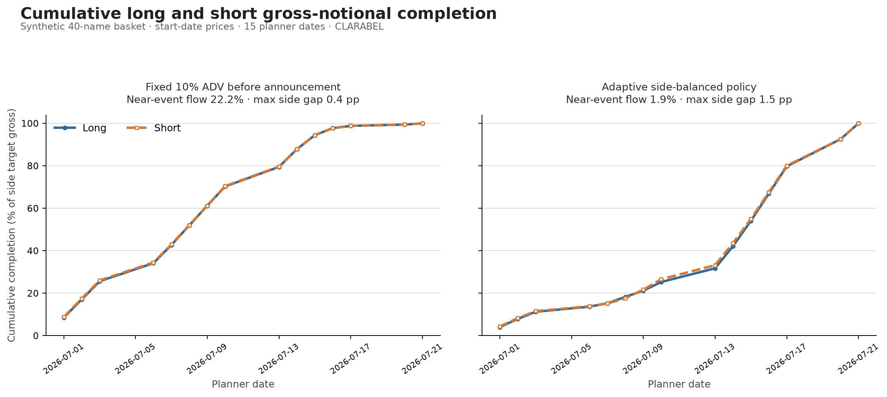

# Adaptive announcement participation model

## The idea in one paragraph

The participation model decides the maximum number of shares the planner may
trade for each name on each day. Its purpose is to keep participation low near
a known announcement, restore normal liquidity access after the announcement,
and still leave enough capacity to finish every parent order. The user provides
the order, ADV, the normal participation limit, market-open dates, and the next
announcement date. The model works out the name-specific pace automatically;
the user does not enter a separate “trade 30% before the event” number for each
of 2,000 names.

The model is called `AdaptiveAnnouncementParticipation` in the code.

## What the model controls—and what it does not

The output is a date-by-name matrix of share caps. For example, a cap of 8,000
shares for Stock A on Tuesday means the optimizer may trade anywhere from zero
to 8,000 shares that day, subject to the order direction and the other portfolio
constraints.

This distinction matters:

- **Mandatory pre-event amount** is the minimum that must be traded before the
  announcement if the order is to finish by the end of the horizon.
- **Pre-event cap allowance** is the maximum amount the optimizer is allowed to
  trade before the announcement. It includes a little flexibility above the
  mandatory minimum.
- **Actual pre-event trade** is what the CVXPY optimizer ultimately chooses
  inside that allowance after considering risk, market impact, costs, and all
  other constraints.

The participation model creates the safe envelope. It does not replace the
main trade-scheduling optimization.

## Inputs the user or data provider supplies

For each name, the model uses information the planner already needs:

- signed target shares;
- daily ADV;
- the desk's normal maximum participation rate;
- whether the market is open;
- the next announcement date, represented as days to announcement on each
  planner date; and
- prices, used only to compare long and short gross notional consistently.

There is no per-name pre-announcement percentage input.

## How the model makes the decision

### 1. Start with normal liquidity capacity

On an open day, regular capacity is:

```text
normal daily capacity = normal participation rate × ADV
```

If normal participation is 15% and ADV is 200,000 shares, the regular daily cap
is 30,000 shares. A closed day has zero capacity.

### 2. Split the horizon around the announcement

The announcement date itself is treated as pre-event. The next planner date is
post-event and returns to the regular participation cap.

This convention is deliberately cautious: the model does not assume it is safe
to increase participation before the announcement has occurred.

### 3. Calculate what must be done before the event

The model first asks how many shares could be traded after the announcement at
the regular caps. Anything the post-event window cannot absorb has to be done
before the event:

```text
mandatory pre-event shares
    = max(parent order − total regular post-event capacity, 0)
```

This is the central reason different names receive different paces.

### Example: Stock A automatically gets 30%, Stock B gets 15%

Suppose both parent orders are 100,000 shares.

| Name | Parent order | Capacity available after announcement | Mandatory before announcement |
|---|---:|---:|---:|
| Stock A | 100,000 | 70,000 | 30,000, or 30% |
| Stock B | 100,000 | 85,000 | 15,000, or 15% |

No one typed “30% for A” or “15% for B.” The difference follows directly from
the liquidity and the number of usable dates after each announcement.

If post-event capacity is greater than the entire order, the mandatory
pre-event amount is zero. If the announcement is after the planning horizon,
the entire order is necessarily pre-event because there are no post-event dates
inside this plan.

### 4. Add a small amount of flexibility

An envelope exactly equal to the mandatory minimum would be brittle: every
available post-event share might have to be used, and the optimizer would have
no room to balance risk or costs. The default policy therefore adds 5% of the
remaining discretionary order as flexibility.

For a one-name illustration with side balancing disabled:

```text
pre-event budget
    = mandatory amount
      + 5% × (parent order − mandatory amount)
```

Using the previous numbers:

- Stock A has 30,000 mandatory shares plus 3,500 flexible shares, for a
  33,500-share pre-event allowance before the small capacity buffer.
- Stock B has 15,000 mandatory shares plus 4,250 flexible shares, for a
  19,250-share pre-event allowance before the buffer.

The default 2% capacity buffer is then applied to avoid a numerically fragile
“capacity equals target exactly” boundary. The buffer is solver room, not a
request to trade another 2%.

These are portfolio policy defaults. A desk may adjust them once for the whole
basket; it still does not maintain 2,000 security-level settings.

### 5. Give long and short sides compatible room

Completing longs much faster than shorts, or vice versa, creates a temporary
net and factor exposure that can make P&L less stable. When both the long and
short planning horizons cross an announcement, the model compares their
mandatory pre-event fractions using start-date gross notional.

Suppose the long side must have at least 25% of its crossing-event notional
available before announcements, while the short side only needs 10%. With the
default 5% flexibility, the common allowance is approximately:

```text
25% + 5% × (100% − 25%) = 28.75%
```

The model gives both sides room up to that common fraction when liquidity
allows. Extra short-side room is assigned to the safer short names; it is not
spread blindly across every short.

This is still an allowance rather than a forced trade. The portfolio risk
objective decides how much of the room to use. If side balancing is not wanted,
`balance_sides=False` keeps every name on its independent feasibility-derived
budget.

Names whose announcement lies after the planning horizon are excluded from
this cross-side comparison. Such a name is technically “100% pre-event,” but it
must not force the opposite side to finish 100% before nearer announcements.

### 6. Put optional capacity on safer names and safer dates

Once the total pre-event allowance is known, the model distributes it in two
stages:

1. Across names, optional room goes first to names with more capacity farther
   from their announcements.
2. Within each name, a bounded water-fill gives earlier, farther-from-event
   dates more capacity and gives the announcement date the lowest weight.

The default risk window is five planner days. The weighting is smooth, so there
is no cliff between “day 6” and “day 5.” If the order is urgent, the model can
use more of the earlier pre-event capacity. It only raises a near-event cap when
the safer dates cannot provide enough capacity.

A typical shape is therefore:

| Relative date | Intended behavior |
|---|---|
| Far before announcement | Some capacity if needed for feasibility or balance |
| Five to one days before | Progressively lower cap |
| Announcement day | Lowest pre-event weight |
| First planner day after | Regular participation cap restored |

## How to inspect the inferred decision

The model exposes an explanation table for all names:

```python
from trade_planner import AdaptiveAnnouncementParticipation

policy = AdaptiveAnnouncementParticipation()
summary = policy.allocation_summary(ctx)

print(summary[[
    "side",
    "target_abs_shares",
    "mandatory_pre_fraction",
    "pre_event_cap_fraction",
    "max_pre_participation_rate",
    "max_post_participation_rate",
    "horizon_capacity_ratio",
    "capacity_feasible",
]])
```

The most useful columns are:

- `mandatory_pre_fraction`: the feasibility floor implied by the order and
  post-event capacity;
- `pre_event_cap_fraction`: the maximum pre-event envelope after flexibility,
  side balancing, safe-date allocation, and the capacity buffer;
- `max_pre_participation_rate`: the highest allowed pre-event percentage of ADV;
- `max_post_participation_rate`: the regular rate available after the event;
- `horizon_capacity_ratio`: total allowed horizon capacity divided by the order;
  and
- `capacity_feasible`: whether this participation envelope can finish the order.

The pre-event cap fraction can be slightly above 100% for a name whose entire
horizon is pre-event because of the 2% numerical buffer. Direction and hard
completion constraints still prevent actual trading from exceeding the parent
order.

## How to inspect actual long and short pacing

After the optimizer solves, use `cumulative_side_completion` to distinguish the
allowed envelope from what was actually scheduled:

```python
from trade_planner import cumulative_side_completion

result = planner.solve(ctx)
completion = cumulative_side_completion(ctx, result.schedule)

print(completion[[
    "cumulative_long_pct",
    "cumulative_short_pct",
    "cumulative_gross_pct",
    "long_short_gap_pp",
]])
```

All percentages use each name's start-date price. That keeps the denominator
stable, so a fully completed long side and short side both end at exactly 100%
even if market prices move during the horizon.

For example, if the first row says long completion is 10% and short completion
is 5%, the portfolio has completed five percentage points more of its long
gross than its short gross. `long_short_gap_pp` reports that difference directly.

The included experiment produces this comparison:



## Default policy settings

| Setting | Default | Natural-language meaning |
|---|---:|---|
| `pre_event_flex` | 0.05 | Add limited scheduling room above the feasibility floor |
| `capacity_buffer` | 0.02 | Avoid exact capacity-equals-target numerical edges |
| `risk_window_days` | 5 | Start applying the near-event distance shape five planner days out |
| `announcement_weight` | 0.05 | Give announcement-day capacity only 5% of the far-date priority |
| `risk_shape` | 2.0 | Make the reduction increasingly strong near the event |
| `balance_sides` | `True` | Give crossing-event long and short sides compatible pre-event room |

These are intentionally a small set of portfolio-level controls. They express
desk policy without asking a user to maintain security-level overrides.

## Edge cases and safeguards

- **Announcement on a planner date:** that date remains in the cautious
  pre-event regime.
- **Announcement between planner dates:** dates before it are pre-event; the
  first planner date after it is post-event.
- **Announcement after the horizon:** the name uses only pre-event dates, but it
  does not force the other side to trade before nearer events.
- **No upcoming announcement:** the modifier is neutral and regular caps apply.
- **Closed market:** capacity is zero regardless of the event rule.
- **Insufficient total capacity:** the model does not silently exceed the desk's
  regular caps. The planner remains infeasible and its existing capacity
  diagnostics explain the shortfall.
- **Zero target:** the normal zero-target constraint prevents trading.

## Solver independence

The participation calculation is NumPy-only. It produces the same cap matrix
before CVXPY chooses a backend. The default planner uses license-free CLARABEL,
and automated coverage also solves the same adaptive case with OSQP. MOSEK is
not required for the pmodel.

The planner scales the objective by a positive constant for numerical
conditioning. Multiplying the whole objective by a positive number does not
change the risk-versus-cost trade-off or the mathematical optimum.

## What the model deliberately does not claim

- It is not an announcement-return or alpha forecast.
- It does not decide whether the announcement will be good or bad.
- It assumes the supplied next-announcement date is the best date currently
  known and should be refreshed as the data provider updates it.
- Avoiding the pre-event window can concentrate more flow after the event. A
  daily gross-notional constraint can be added if the desk also needs a hard
  portfolio-wide daily flow ceiling.
- The current policy treats the first upcoming announcement as the relevant
  boundary. A horizon containing several announcements for one name would need
  a repeated-event extension.

## Reproducing the comparison

Run:

```bash
python experiments/participation_refinement.py
```

In the included synthetic 40-name basket, the retained adaptive policy reduced
gross traded in the final two days before announcements from 22.2% under the
feasible fixed-rate comparison to 1.9%. Its maximum cumulative long-versus-short
completion gap was 1.5 percentage points. The trade-off was a higher peak daily
gross percentage after flow was deferred beyond announcements.

The experiment also exports the source metrics and cumulative curves under
`artifacts/` so the chart can be audited rather than treated as a decorative
result.
